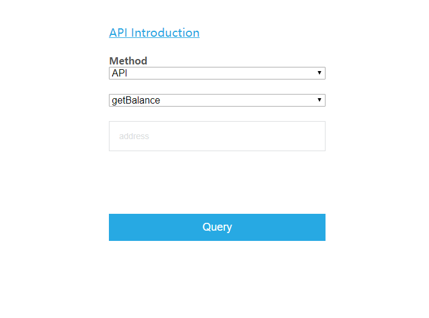
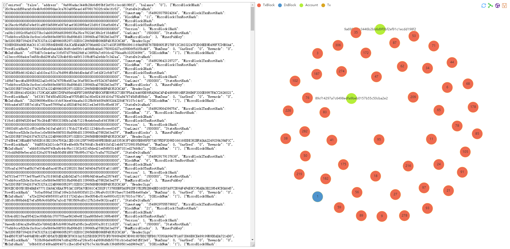

### 1. Demo's File Structure
```
─Zilliqa
   ├─documets
   |   ├─document.md
   |   ...
   ├─log
   |   ├─out.log
   |   ...
   ├─pictures
   ├─scripts
   |   ├─getdata.py
   |   ...
   ├─static
   │   ├─js
   |   |   ├─jquery-3.4.1.min.js
   |   |   ├─echarts-all.js   
   |   |   ...
   │   ├─css
   |   |   └─style.css
   ├─templates
   │   ├─index.html
   │   ├─result.html
   |   ...
   └─app.py
```
### 2. How to Use
#### 2.1 Query Interface
&emsp;&emsp;You can choose **```'Method': API or CQL```**, and after you choose **```API```**, you'll continue to choose **```'api_method': contains getBalance, getTxs, getMiners, getAccountTxs, getMinedBlock```**

#### 2.2 Result Interface
&emsp;&emsp;You'll get the json_data of your query  on the page's left and **one echarts graph** on the right.


### 3. Docs
&emsp;&emsp;the apis' doc is [API-Docs](documents/apis.md).
&emsp;&emsp;the demo's doc is [Demo-Docs](documents/document.md).