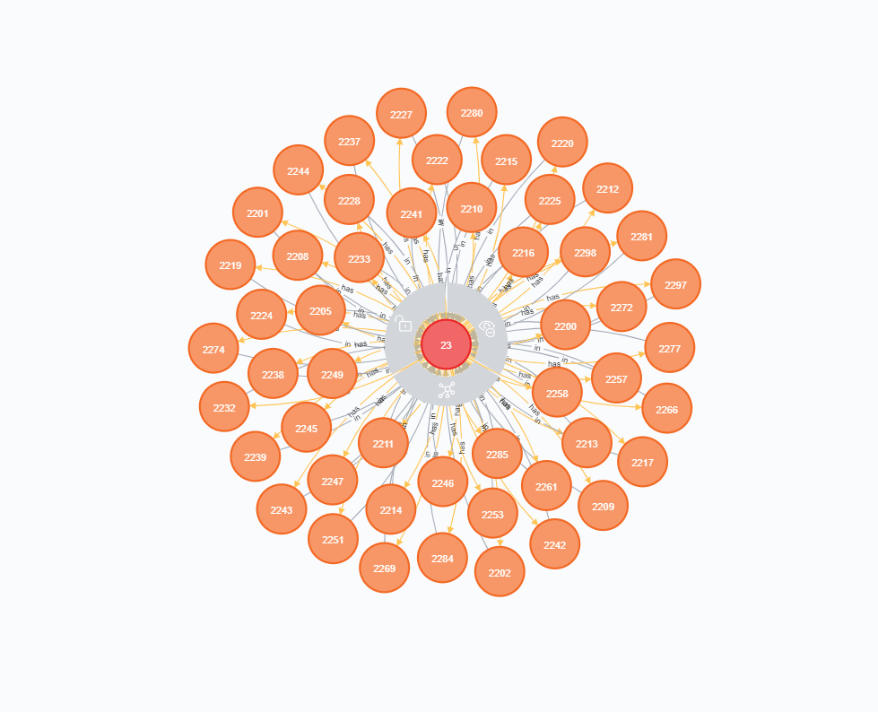

## 一、19-5-30<u>（7-23：下划线+粗 表示更新）</u><span style="color:red">（9-15：红色加粗字体 表示更新）</span>
### 初步下载到Neo4J中及节点 & 关系的定义和展示
#### 1 利用[官方提供的JSON-RPC API](https://apidocs.zilliqa.com/#introduction)以及Python的[Requests](http://docs.python-requests.org)库和[py2neo]库(https://py2neo.org/v4/)对Zilliqa上的数据进行下载并将数据保存到[Neo4J](https://neo4j.com/)图形数据库中。在getdata.py文件中分别对Zilliqa链上的数据进行了初步的分类和下载保存。
##### 1.1 分别有以下四种label：
|TxBlock|Contents|DSBlock|Contents|
|--|--|--|--|
|"BlockNum"|块号|"BlockNum"|块号|
|"DSBlockNum"|所属DS块号|"Difficulty"|难度|
|"MinerPubKey"|矿工公钥|"PoWWinners"|PoW赢家|
|"NumTxns"|交易数量|"LeaderPubKey"|Leader公钥|
|"PrevBlockHash"|上一块的Hash|"PrevHash"|上一块的Hash|
|"Rewards"|奖励|"signature"|签名|
|"Timestamp"|时间戳|"Timestamp"|时间戳|

|Tx|Contents|Account|Contents|
|--|--|--|--|
|"ID"|交易的Hash|"address"|账户地址|
|"amount"|交易金额|<u>**"balance"**</u>|<u>**账户余额**</u>|
|"senderPubKey"|发送者的公钥|<u>**"existed"**</u>|<u>**账户是否还存在**</u>|
|"signature"|签名|||
|"toAddr"|接收者的地址|||

##### 1.2 另外，这四种label之间有多个关系，具体如下：
|Relations|Between|Contents|
|--|--|--|
|from|Tx->Account|表示交易Tx来自Account|
|send|Account->Tx|表示Account发出了交易Tx|
|to|Tx->Account|表示交易Tx发送到Account|
|receive|Account->Tx|表示Account收到了交易Tx|
|mine|Account->TxBlock|表示Account挖到TxBlok|
|mined|TxBlock->Account|表示TxBlok被Account挖到|
|has|DSBlock->TxBlock&TxBlock->Tx|表示DSBlock(TxBlock)中含有TxBlock(Tx) <u>**新增顺序**</u>|
|in|DSBlock->TxBlock&TxBlock->Tx|表示TxBlock(Tx)在DSBlock(TxBlock)中 <u>**新增顺序**</u>|
|traded|Account->Account|表示两者之间有过交易 <u>**新增交易的Hash值**</u>|

#### 2 下载进度 & 节点和关系的展示
##### 2.1 下载进度，即已保存的节点数量
|DSBlockNums|TxBlockNums|TxNums|Accounts|
|--|--|--|--|
|<u>**816**</u>|<u>**81525**</u>|<u>**62218**</u>|<u>**10708**</u>|
|**<div style="color:red">1710</div>**|**<div style="color:red">170900</div>**|**<div style="color:red">220424</div>**|**<div style="color:red">34559</div>**|

<b>count(has) = count(Tx) + count(TxBlock)</b>

##### 2.2 节点内容展示
<!-- 


 -->
&emsp;&emsp;<u>**pass**</u>

#### <u>3 API设计 & 实现</u>
##### <u>3.1 实现的API</u>

待设计。

#### <u>4 Issues & Operations</u>
##### <u>4.1 Issues</u>
1. 19/06/22，昨晚同步的时候出现了`GetTransaction` 出现错误的情况，跟代码无关，是api 的问题。
	解决：`GetTransaction` 错误则重新`GetTransaction`
2. 19/06/22，Tx 已存在不该这么写，否则会在删除TxBlock 时失去TxBlock 与Tx 之间的关系。
	解决：Tx 已存在时同样需要添加TxBlock 与Tx 之间的关系
3. 19/06/24，半天找不到`py2neo.data.Node` & `py2neo.data.Relationship`的`id`以及前者的label。
	解决：`GraphObject.identity, list(py2neo.data.Node.labels())`
4. 19/06/25，半天找不到`py2neo.data.Relationship` 的头节点和尾节点以及关系名。
	解决：`py2neo.data.Relationship.start_node/end_node, list(py2noe.data.Relationship.types())`
4. 19/06/25，Python-Flask向js传递json数据时js解析数据出现错误。
	解决：`js code: eval({{json_data|safe }})`，需要加上`safe `
5. 19/07/18，`getdata.py`代码同步速度缓慢，一个交易`5s`，需进行优化。
	解决：待解决（已解决，跟网络环境有关）
6. 19/08/27，`app.py`代码查询节点数目过多时速度缓慢，需进行优化。
	解决：待解决
7. 19/09/02，`175334`块出现问题，似乎是撤回了一些个交易，无法查到其中的19个交易信息，导致getdata.py 跑不动了。
	解决：在getdata.py中对该块进行特殊处理即可
9. 19/09/20， `232894`块由于不知名原因断开同步，检查日志后未发现异常，继续更新
10. 
##### <u>4.2 py2neo 操作</u>
```python
1. walk(GraphObject)
2. dict(GraphObject)
3. GraphObject.identity
4. py2neo.data.Relationship.start_ndoe/end_node
5. list(py2neo.data.Node.labels())
6. list(py2neo.data.Relationship.types())
7. 
```
常用查询语句:

```batch
match (n:TxBlock{BlockNum:"59903"})-[has]->(p:Tx)return count(p)
match ()-[p:has]->() return count(p)
```
